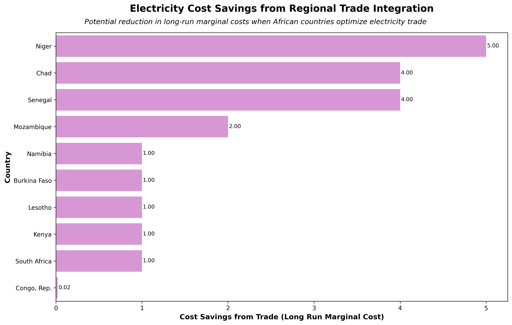
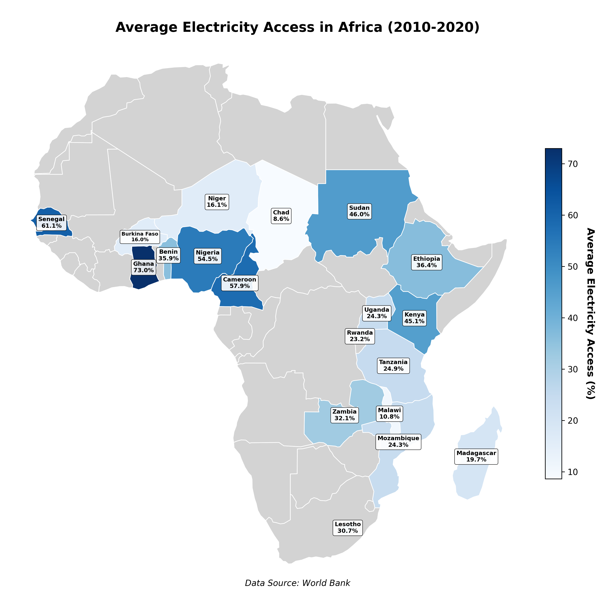
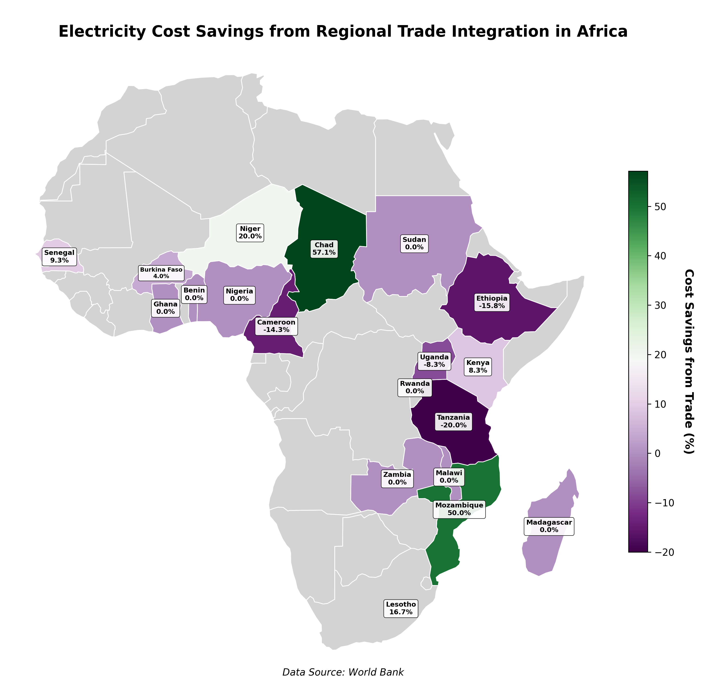
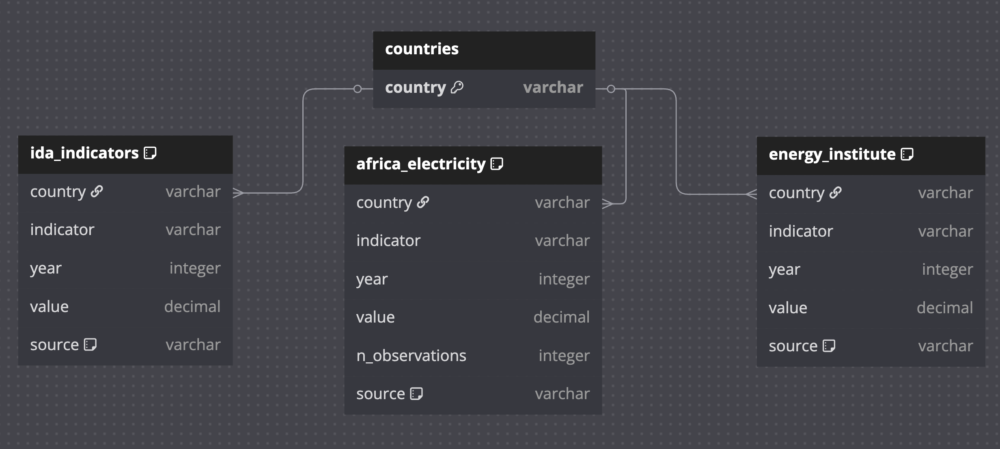

# Africa Trade and Energy Indicators Database

## Description

This repository houses code used to create a database of energy infrastructure statistics, energy cost projections, and human development indicators for Africa derived three different from World Bank and Energy Institute datasets.

Additionally, it contains files for querying and visualizations derived from these queries that answer the question of how different trade scenarios impact electricity cost and access across different countries in Africa.

## Data Visualizations

Please see `data_visualization.ipynb` for the code used to create these visualizations.

These packages are required for data cleaning: `os`, `numpy`, `pandas` and data visualization: `duckdb`, `geopandas` `matplotlib`, `numpy`, `pandas`, `seaborn`.







## Database Schema

The below diagram, created using [dbdiagram.io](https://dbdiagram.io/home) outlines the structure and organization of the database. It contains four tables: `countries`, `ida_indicators`, `africa_electricity`, and `energy_institute`.



## Data Access

Sources:

| Dataset | Publisher | Description | Citation/Link |
|---|---|---|---|
| IDA Results Measurement System | World Bank | Measures progress on aggregate outcomes for International Development Association countries for selected indicators. | https://databank.worldbank.org/source/ida-results-measurement-system,-tier-i-database-%E2%80%93-wdi/Series/EG.ELC.ACCS.ZS |
| Africa Infrastructure: Electricity | World Bank | Measures electricity infrastructure for Africa, contains series on electricity costs under different regional trade scenarios. | https://databank.worldbank.org/source/africa-infrastructure:-electricity |
| 2024 Statistical Review of World Energy | Energy Institute | Data on world energy markets (sources, generation/consumption, prices, emissions). | Energy Institute (2024), Statistical Review of World Energy 2024, Energy Institute, London. Available online at: https://www.energyinst.org/statistical-review/home |

The `data_cleaning.ipynb` notebook details code used to clean the above datasets for ingestion into the database, and the database setup code is located in `setup_db.sql`. 

## Repository Structure

```
📦
├── data
│   ├── cleaned_data # cleaned data for ingestion into database 
│   │   ├── 00_cleaned_indicators.csv
│   │   ├── 01_africa_electricity_infrastructure.csv
│   │   └── 02_energy_institute_africa.csv
│   ├── energy_institute 
│   │   └── Statistical Review of World Energy Data.xlsx # raw energy institute markets data
│   ├── world_bank
│   │   ├── P_Data_Extract_From_Africa_Infrastructure_Electricity.xlsx # raw africa electricity data
│   │   └── P_Data_Extract_From_IDA_Results_Measurement_System.xlsx # raw economic and human development indicators data
│   └── africa_energy.db # database!
├── figures
│   ├── africa_electricity_access_map.png # data visualization 2
│   ├── africa_lrmc_savings.png # data visualization 1
│   ├── africa_trade_map.png # data visualization 3
│   └── er-diagram.png # schema diagram
├── .gitignore
├── data_cleaning.ipynb # notebook for data cleaning
├── data_visualization.ipynb # notebook for data visualizations
├── LICENSE
├── queries.sql # queries used to produce data visualizations
├── README.md
├── requirements.txt # project packages and dependencies
└── setup_db.sql # DuckDB sql code used to set up database
```

## Environment & Dependencies

**Version:** Python 3.7.13

Please see `requirements.txt` for project packages and dependencies.

## Author

Leilanie Rubinstein

Master of Environmental Data Science Student, Bren School of Environmental Science & Management

(leilanierubinstein@gmail.com)

(rubinstein@bren.ucsb.edu)

## Acknowledgments 

*This project was produced as an assignment for Bren School of Environmental Science & Management course EDS 213: Databases and Data Management (2025). Materials and instructions were produced by Annie Adams, Julien Brun, and Greg Janée.*